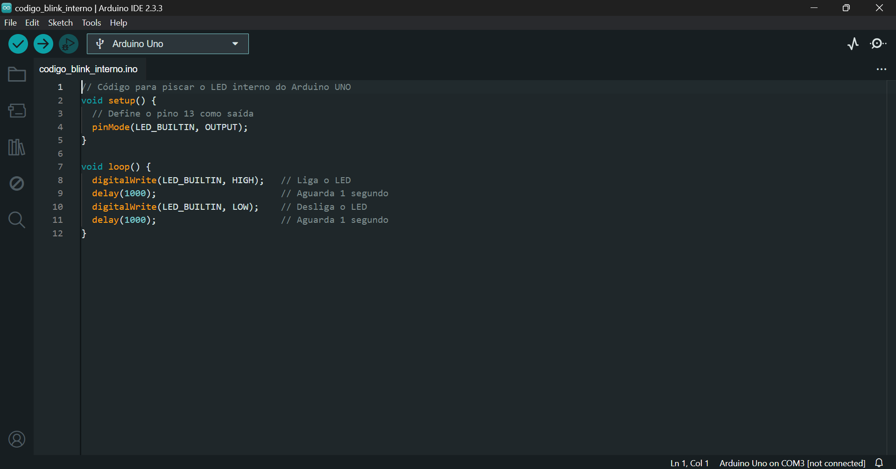
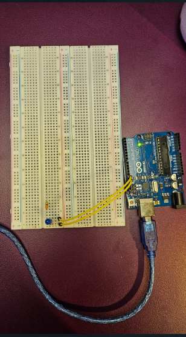
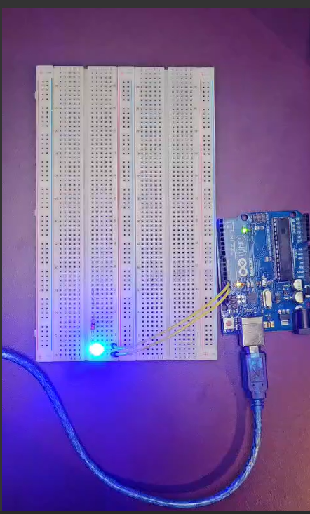
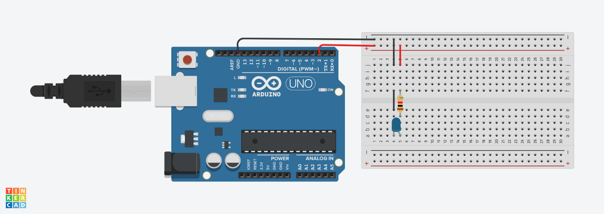
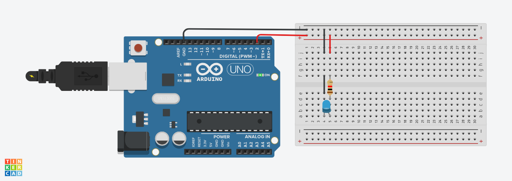
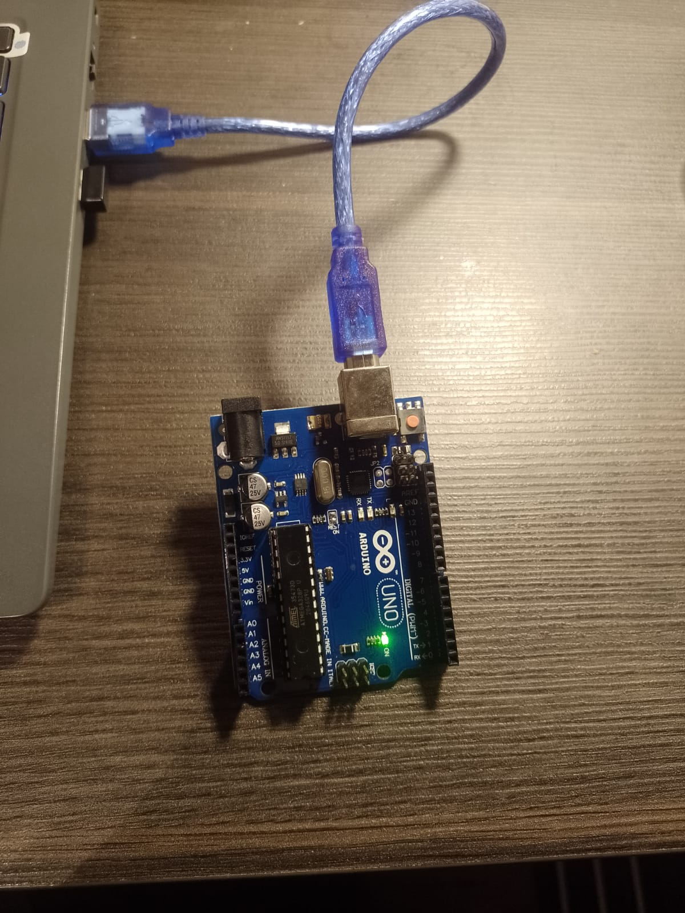
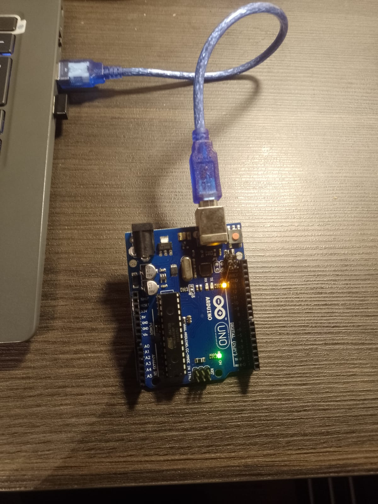

# Projeto IoT: Blink Interno e Simulação de Blink Externo
### Marco Ruas Sales Peixoto - Turma 14

&nbsp;&nbsp;&nbsp;&nbsp;Este repositório contém as atividades ponderadas relacionadas ao uso do Arduino UNO para realizar um pisca-pisca (Blink) tanto com o LED interno quanto com um LED externo, utilizando a simulação no TinkerCad e na prática.

## Sumário
1. [Introdução](#introdução)
2. [Requisitos](#requisitos)
3. [Parte 1: Blink LED Interno](#parte-1-blink-led-interno)
    - [Instalação da Arduino IDE](#instalação-da-arduino-ide)
    - [Código Blink](#código-blink)
    - [Evidências](#evidências)
4. [Parte 2: Simulação Blink Externo no TinkerCad](#parte-2-simulação-blink-externo-no-tinkercad)
    - [Montagem no TinkerCad](#montagem-no-tinkercad)
    - [Código TinkerCad](#código-tinkercad)
    - [Evidências](#evidências-simulação)
5. [Conclusão](#conclusão)

## Introdução

&nbsp;&nbsp;&nbsp;&nbsp;O Arduino UNO é uma das plataformas mais populares para prototipagem eletrônica. Neste projeto, exploramos o uso do LED interno (LED_BUILTIN) e a criação de um circuito externo com um LED conectado ao Arduino para simular um pisca-pisca, ambos usando programação simples em C++.

## Requisitos

- Arduino UNO
- Arduino IDE instalada
- Conta no TinkerCad para simulação de circuitos
- Protoboard, LED externo, resistores e fios de conexão para a Parte 2

## Parte 1: Blink LED Interno

### Instalação da Arduino IDE

1. Baixar e instalar a [Arduino IDE](https://www.arduino.cc/en/software) no computador.
2. Configurar a IDE para reconhecer a porta onde o Arduino UNO está conectado.

### Código Blink

&nbsp;&nbsp;&nbsp;&nbsp;O código abaixo faz com que o LED interno do Arduino UNO pisque em intervalos definidos:

```cpp
// Código para piscar o LED interno do Arduino UNO
void setup() {
  // Define o pino 13 como saída
  pinMode(LED_BUILTIN, OUTPUT);
}

void loop() {
  digitalWrite(LED_BUILTIN, HIGH);   // Liga o LED
  delay(1000);                       // Aguarda 1 segundo
  digitalWrite(LED_BUILTIN, LOW);    // Desliga o LED
  delay(1000);                       // Aguarda 1 segundo
}
```


### Evidências

- **Screenshots:** Imagem do código realizado no Arduino IDE.

<div align="center"> 
 <sup>Código no Arduino IDE<sup>
  
 <sup>Fonte: Elaborado pelo autor(2024)<sup> 
</div>

- **Fotografia:** Foto do arduino.

<div align="center"> 
 <sup>Circuito - Desligado<sup>
 <br>
  
 <br>
 <sup>Fonte: Elaborado pelo autor(2024)<sup> 
</div>

<div align="center"> 
 <sup>Circuito - Ligado<sup>
 <br>
  
 <br>
 <sup>Fonte: Elaborado pelo autor(2024)<sup> 
</div>


- **Código:** [Código do Arduino](/codigo_blink_interno/codigo_blink_interno.ino).

## Parte 2: Simulação Blink Externo no TinkerCad

&nbsp;&nbsp;&nbsp;&nbsp;Nesta etapa, é feita uma simulação de um pisca-pisca utilizando um LED externo em um protoboard no TinkerCad.

### Montagem no TinkerCad

1. Monte o circuito com o Arduino UNO, protoboard, LED externo e resistor no TinkerCad.
2. Configure as conexões apropriadas entre os componentes:
   - Conecte o LED ao pino digital 6 do Arduino.
   - Adicione um resistor para limitar a corrente.
   - Ligue o circuito corretamente no protoboard.

### Código TinkerCad

&nbsp;&nbsp;&nbsp;&nbsp;O código a seguir controla o LED externo na simulação do TinkerCad:

```cpp
// Define o pino do LED externo;
#define ledPin 6

void setup() { 
    // Define o pino como saída 
    pinMode(ledPin, OUTPUT); 
}

void loop() { 
    // Liga o LED externo 
    digitalWrite(ledPin, HIGH); delay(500); // Aguarda 0,5 segundos 
    // Desliga o LED externo 
    digitalWrite(ledPin, LOW); delay(500); // Aguarda 0,5 segundos 
}

```


### Evidências Simulação

- **Link do Projeto TinkerCad:** [Link da simulação](https://www.tinkercad.com/things/0vw3lg7u9ep/editel?sharecode=gEYA1XpCebyuIhI2550nHrYGJArflmcU0x3_xEOY8-I).
- **Screenshot:** Fotos da simulação ligado e desligado realizadas no Tinkercad.
<div align="center"> 
 <sup>Simulação no Tinkercad - Desligado<sup>
 <br>
  
 <sup>Fonte: Elaborado pelo autor(2024)<sup> 
 <br>
</div>

<div align="center"> 
 <sup>Simulação no Tinkercad - Ligado<sup>
 <br>
  
 <br>
 <sup>Fonte: Elaborado pelo autor(2024)<sup> 
</div>

- **Vídeo de funcionamento:** [Vídeo da simulação](/assets/simulacao.mp4)
- **Código:** [Código do Arduino](/codigo_simulacao/codigo_simulacao.ino).

## Extra: Blink Externo com Arduino
&nbsp;&nbsp;&nbsp;&nbsp;Nesta etapa, é realizado a atividade de piscar o led utilizando o arduino uno. Abaixo encontra-se a atividade realizada:

<div align="center"> 
 <sup>Blink - Desligado<sup>
 <br>
  
 <br>
 <sup>Fonte: Elaborado pelo autor(2024)<sup> 
</div>

<div align="center"> 
 <sup>Blink - Ligado<sup>
 <br>
  
 <br>
 <sup>Fonte: Elaborado pelo autor(2024)<sup> 
</div>

## Conclusão

&nbsp;&nbsp;&nbsp;&nbsp;Neste projeto, foram abordados os conceitos básicos de programação e controle de hardware com Arduino, utilizando tanto o LED interno quanto a simulação com componentes externos. Estas atividades são fundamentais para iniciantes que desejam explorar o potencial da plataforma Arduino em prototipagem eletrônica.
